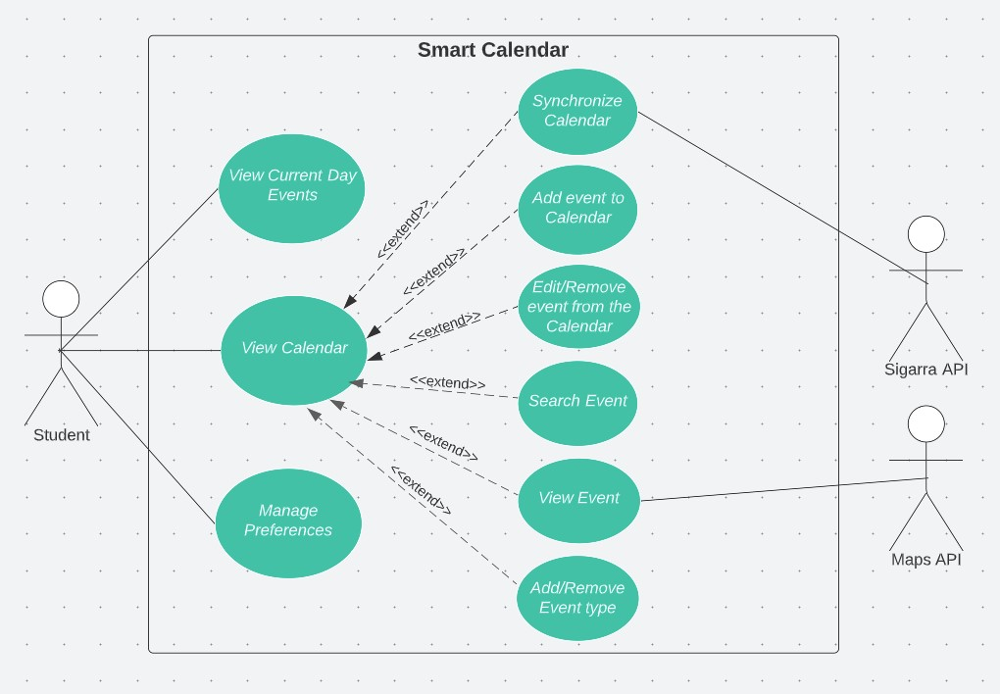

## Use Cases

### Use Case diagram
 

  

#### UC1: View current day events
|  | Description |
| --- | --- |
| *Name* | View current day events |
| *Actor* | Student | 
| *Description* | The student is provided with a list representation for the current day events. |
| *Preconditions* | - The student must be logged-in. |
| *Postconditions* | - The system displays a list of the events scheduled for that day 
| *Normal flow* | 1. The student selects the "Agenda" tab in the navigation bar.   2. The system slides into a list-view of the events scheduled for that day. |
| *Alternative flows and exceptions* | **Exceptions:**   1. [*No events*] In step 2, the system prints a "No events for today!" if there are no events for that day.|

#### UC2: View calendar
|  | Description |
| --- | --- |
| *Name* | View calendar |
| *Actor* | Student | 
| *Description* | The student is given a view of the calendar. |
| *Preconditions* | - The student must be logged-in. |
| *Postconditions* | The student can acess from view calendar to functions such as synchronize, add, edit or delete |
| *Normal flow* | 1. The student selects the "Calendar" tab.   2. The system displays the view of the calendar (a monthly view by default). |
| *Alternative flows and exceptions* | **Exceptions:**   1. [*Redirect*] The student can reach the calendar after completing an action such as adding an event, synchronizing or even after logging in.|

#### UC3: Synchronize calendar
|  | Description |
| --- | --- |
| *Name* | Synchronize calendar |
| *Actor* |  Student | 
| *Description* | The student synchronizes its calendar with the one in SIGARRA, retrieving not only the calendar, but also the student's timetable. |
| *Preconditions* | - The student must be logged-in.   - The student must be in the calendar view. |
| *Postconditions* | - The student's calendar is merged with the SIGARRA's one, preserving self-added events from the user.   - The student's calendar is "injected" with the student's timetable (creating a new event for each class). |
| *Normal flow* | 1. The student selects the synchronize button.   2. The student is prompted for confirmation in a small window.   3. The student hits the *Confirm* button.   4. While establishing connection to SIGARRA and downloading new data, the system displays a loading screen.   5. The system updates the student's calendar according to data retrieved from SIGARRA. |
| *Alternative flows and exceptions* | **Exceptions:**   1. [*API communication failure*] If, in step 4 the communication between SIGARRA and the system is not established, the student gets informed of the issue and is asked to check for Wi-Fi connection and to try again later if the problem persists. The student's calendar should remain unchanged.|

#### UC4: Add event to calendar
|  | Description |
| --- | --- |
| *Name* | Add event to calendar |
| *Actor* |  Student | 
| *Description* | The student creates a new event on a specific date. |
| *Preconditions* | - The student must be logged-in.   - The student must be in the calendar view. |
| *Postconditions* | - The new event is stored in the device/database. |
| *Normal flow* |1 The student hits a button in the bottom right corner of the device to add a new event.   2. The student is prompted for the event details, including the targeted date, duration, type and event name.   3. The student enters the necessary inputs.  4.The student presses the save button to store the newly created event.   5. The student is redirected back to the calendar.  |
| *Alternative flows and exceptions* | **Exceptions:**   1. [*Cancelling event creation*] If, in step 3 or 4 either the cancel button or the back button in the navigation bar of the device are pressed, the event creation is aborted and the student directly returns to the calendar view of the system.   2. [*Null fields*] In step 3, some of the request fields might be mandatory. If one attempts to save the event without filling mandatory fields, those fields should get outlined red and a small text should appear under each one: "This field cannot be empty". Saving the event won't happen until the previous condition is fulfilled.    3. [*Storage failure*] When saving the new event on step 4, if the normal flow of storing new data is cancelled due to storage shortage, the system displays an alert to inform the student. The student must hit a button on the prompt to get redirected back to the calendar. |

#### UC5: Edit/Remove events from the calendar
|  | Description |
| --- | --- |
| *Name* | Edit/Remove events from the calendar |
| *Actor* | Student | 
| *Description* | The student can edit or remove existing events, both self-added and obtained from synchying. |
| *Preconditions* | - The student must be logged-in.   - To remove or edit the event, the event must exist in the first place.   - The student must be either in calendar view or in the search results view. |
| *Postconditions* | - The changes made are stored in the device/database. |
| *Normal flow* | 1. The student selects a date from the calendar.   2. The student selects an existing event on the previously selected date.   3. The system expands the event widget uncovering a edit and remove buttons   4. The student selects one of the two and is either redirected to a new UI to edit the event or to the calendar after eliminating the event. |
| *Alternative flows and exceptions* | 1. **Exceptions:**   1.[*Null fields*] In step 4, if one attempts to edit and save an event after erasing mandatory fields, those fields should get outlined red and a small text should appear under each one: "This field cannot be empty". Saving the event won't happen until the previous condition is fulfilled.   2.[*Storage failure*] If editing is chosen on step 4 and the student proceeds to saving the changes, if the normal flow of storing new data is cancelled due to storage shortage, the system displays an alert to inform the student. The student must hit a button on the prompt to get redirected back to the calendar.   3. [*Confirmation*] When deleting an event, the student is asked for confirmation. |

#### UC6: Search events
|  | Description |
| --- | --- |
| *Name* | Search events |
| *Actor* |  Student | 
| *Description* | The student makes use of a search area to filter events from the calendar. |
| *Preconditions* | - The student must be logged-in.   - The student must be in the calendar view. |
| *Postconditions* | - If the search results exist, the system responds with a list view of the search results. |
| *Normal flow* | 1. The student hits the search button.   2. The system transforms the UI and displays a search bar and filters (events in a given month, events between a specified date range, events of a given type, ...).   3. The student inputs a string.   4. The system parses the calendar and retrieves any event containing the input as a substring in its name.   5. The system replies with a list and number of events that match the previous condition. |
| *Alternative flows and exceptions* | **Alternative Flows:**   1. The student hits the search button.   2. The system transforms the UI and displays a search bar and filters (events in a given month, events between a specified date range, events of a given type, ...).   3. The student activates some of the filters without inputing a search string.   4. The system parses the calendar and retrieves any event matching all the active filters.   5. The system replies with a list and number of events that match the previous condition.    **OR**    1. The student hits the search button.   2. The system transforms the UI and displays a search bar and filters (events in a given month, events between a specified date range, events of a given type, ...).   3. The student inputs a search string and activates some filters.   4. The system scrolls through the calendar and retrieves any event matching the request assembled by the active filters and the input search string.   5. The system replies with a list and number of events that match the previous condition.    **Exceptions:**   1. [*Empty search*] If, in step 4, the search results return back empty, a message should be displayed in the last step. |

#### UC7: Manage preferences
|  | Description |
| --- | --- |
| *Name* | Manage preferences |
| *Actor* |  Student | 
| *Description* | The student manages its settings preferences amongst event, calendar and notification settings. |
| *Preconditions* | - The student must be logged-in. |
| *Postconditions* | - The student's settings get updated and stored on the device.   - The system responds accordingly to the new settings changes, often reflected on UI changes.    |
| *Normal flow* | 1. The student hits the "Settings" tab on the navigation bar.   2. The system shifts between the calendar and the settings UI.   3. The student accesses the area(s) that fit the desired change(s) the best (event, calendar or notification areas).   4. The student carries out the modifications.   5. The student confirms the alterations by hitting the save button. |
| *Alternative flows and exceptions* | **Exceptions:**   1. [*Cancelling modifications*] If, in step 3, 4 or 5 either the cancel button or the back button in the navigation bar of the device are pressed, the event creation is aborted and the student directly returns to the calendar view of the system. |

#### UC8: View event details
|  | Description |
| --- | --- |
| *Name* | View event details |
| *Actor* |  Student | 
| *Description* | The student views the details of the selected event. |
| *Preconditions* | - The student must be logged-in   - There must be existing events. |
| *Postconditions* | - The student gets access to the event location on Maps and the event details    |
| *Normal flow* | 1. The student chooses an exsting event.   2. The event details, including the location, shows up.   |
| *Alternative flows and exceptions* | **Exceptions:**   1. [*Missing location*] If the location is not specified/ doesn't exist, the UI displays the details without the location |

#### UC9: Create/Delete event type
|  | Description |
| --- | --- |
| *Name* | Create/Delete event type |
| *Actor* | Student | 
| *Description* | The student may create or delete an event type |
| *Preconditions* | - The student must be logged-in   - An event must be selected |
| *Postconditions* | - An event type is created/deleted |
| *Normal flow* | 1. The student selects the "Event Type" button.   2. The student clicks on the add button.   3. The student fills in the name of the type and selects an icon.   4. The student presses the "Save" button and the new type is created |
| *Alternative flows and exceptions* |  **Alternative Flows:**   1. The student selects the "Event Type" button.   2. The student clicks on the "X" button   3. The event type is deleted     **Exceptions:**   1. [*Cancel button*] In step 4 of the normal flow, if the "Cancel" button is pressed the action is canceled, no type is created and the student is redirected to step 1. |

